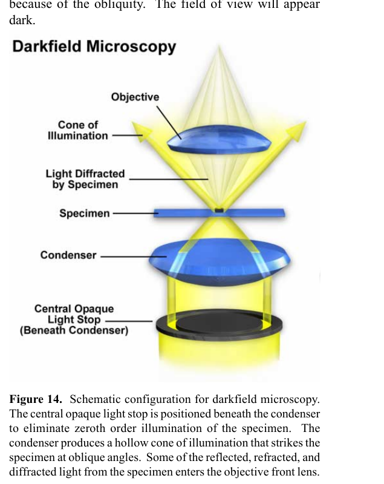
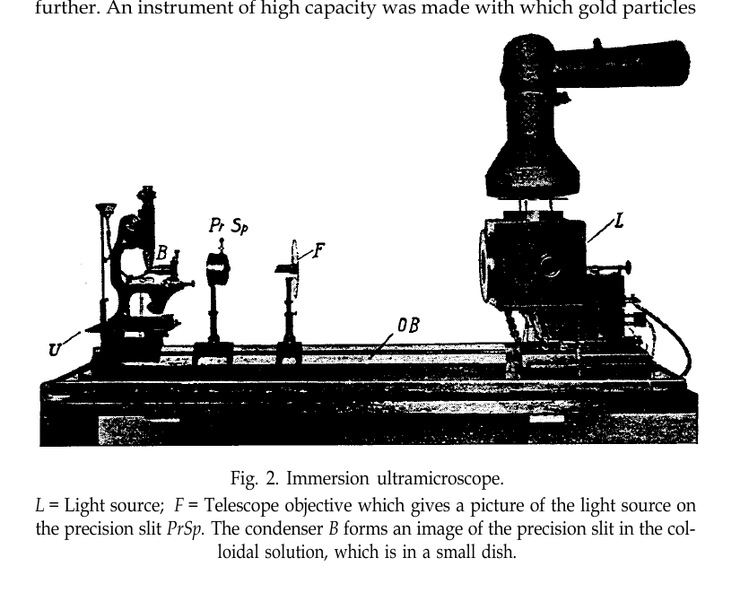
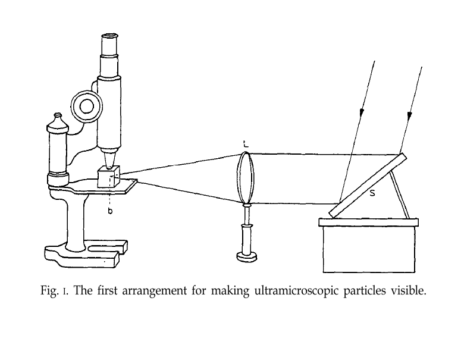
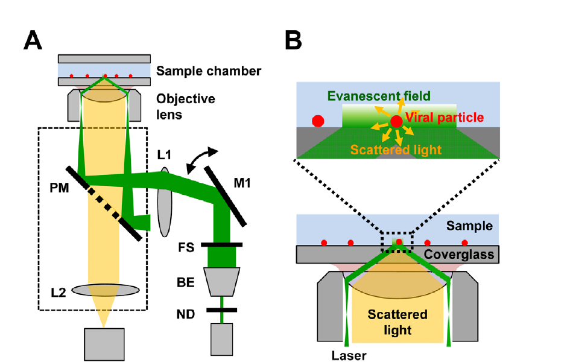
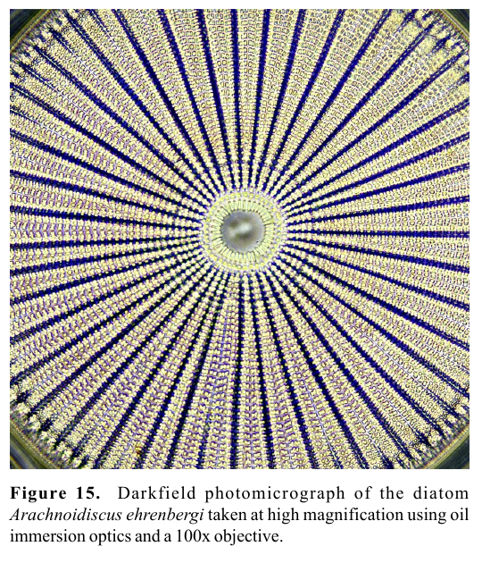
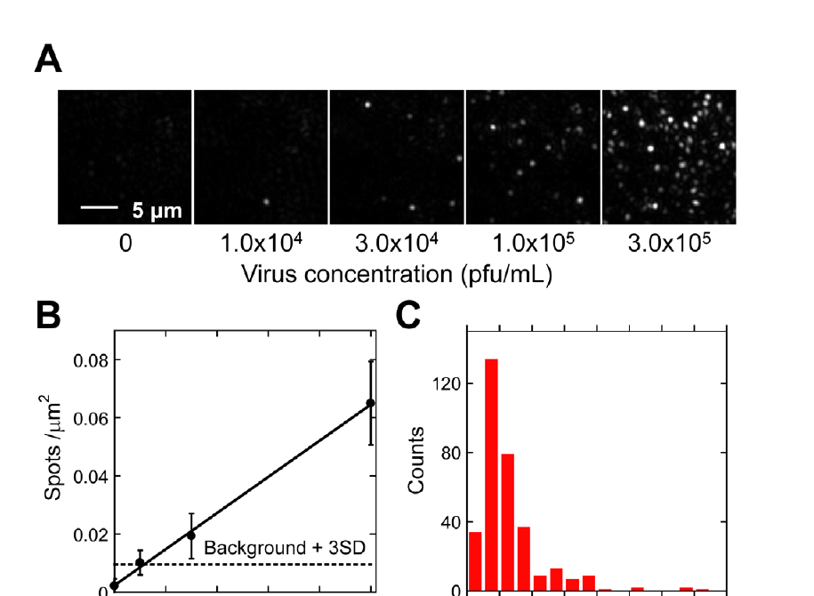

# 先看这五张图：暗场显微镜到底怎么工作、长什么样

## 1. 它的核心不是“把背景涂黑”，而是让直射光进不了物镜

从下往上读图：

1. 中央遮光片挡住正中间的直射光。
2. 聚光镜只把外围光线汇成一个空心光锥，斜着照向样品。
3. 如果没有样品，斜射光会从物镜旁边掠过，所以视野是黑的。
4. 样品把一部分光散射、折射或衍射进物镜，于是样品变亮。

最重要的判据是：照明光锥的数值孔径要大于物镜接收直射光的数值孔径。用一句课堂语言说，就是“灯光故意绕开镜头，只有被样品打偏的光才能进镜头”。

## 2. 它在外观上往往仍是一台普通显微镜

真正决定暗场的部件常藏在载物台下方：

- 低倍观察时，可以在普通聚光镜下加入一块中央不透光的圆片，也叫暗场遮光片或 spider stop。
- 高数值孔径观察时，常换成专用暗场聚光镜；浸没式暗场还会在聚光镜和载玻片之间加油或水。
- 反射暗场用于不透明样品，常把环形照明路径做在物镜外围；看起来更像一只较粗的专用物镜。

所以，“暗场显微镜长什么样”的准确答案不是某一种固定机身，而是：普通显微镜机架 + 能制造斜射空心光锥的照明组件 + 合适数值孔径的物镜。

下面这台 20 世纪初的浸没式超显微镜外形很夸张，但它把暗场系统的几部分分得很清楚：右侧是光源，中央是狭缝和聚光系统，左侧显微镜从不接收直射光的方向观察。

## 3. 最早的典型结构：从侧面照，观察方向与直射光分开

这张图特别适合连接天文观测：看暗弱目标时，第一件事不是继续放大，而是压低进入探测器的背景光。图中照明光从右侧进入样品，显微镜从上方观察；未被样品散射的光不会直接进入物镜。现代透射暗场把同一个思想压缩到了载物台下方的环形光路里。

## 4. 现代变体：全内反射暗场只照亮界面附近

绿色激光以大角度射到玻璃—样品界面并发生全内反射。界面上方只留下很薄的倏逝场，靠近表面的病毒颗粒会把这部分能量散射出来；散射光再被同一物镜收集。它同时完成两次“去背景”：不让激光直射进入相机，并把照明限制在界面附近。

## 5. 最终看到什么：黑底上的亮边、亮点和颜色

硅藻的细微纹理改变光的传播方向，因此在暗背景上显得明亮。暗场尤其擅长显示边缘、颗粒、折射率变化和表面微小缺陷，但亮度不直接等于样品厚度或真实颜色。

这张图说明暗场并不只“好看”：病毒浓度增加时，单位面积亮点数增加，作者据此得到约 `1.2 × 10^4 PFU/mL` 的检测限。也就是说，散射亮点可以进一步变成计数和定量数据。

## 看图时抓住四个问题

1. 哪一束光被主动挡掉或偏离了物镜？
2. 样品通过散射、折射、反射还是衍射把光送进物镜？
3. 背景为什么黑，背景噪声来自哪里？
4. 图像中的亮度、颜色或亮点数，最后对应什么物理量？

## 不要和相差显微镜混淆

两者都可能看到环形光阑，但目的不同。暗场让未散射的零级光完全避开物镜；相差显微镜则保留参考光，并在物镜后焦面用相环改变它的相位和振幅，使相位差转成亮度差。
